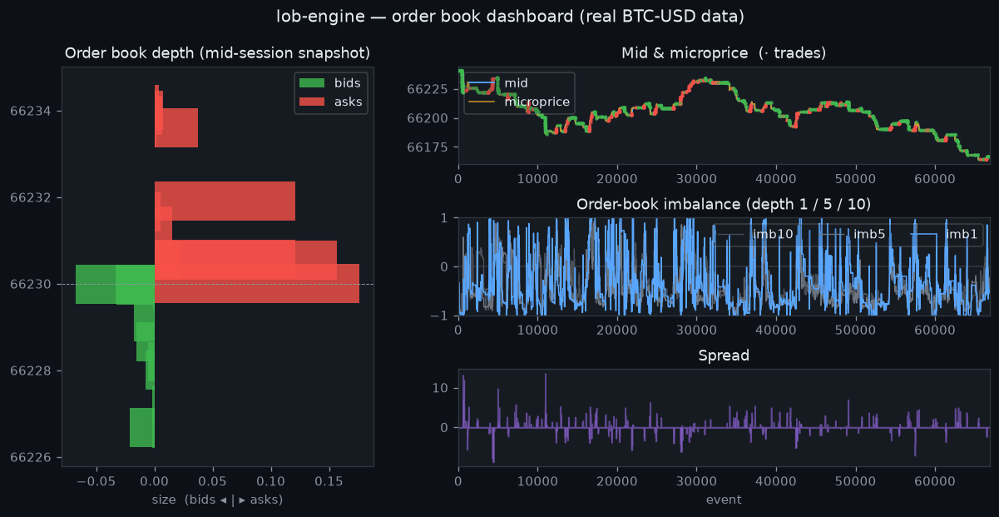

# lob-engine

[](https://github.com/bhedavivan/lob-engine/actions/workflows/ci.yml)


[](LICENSE)

A limit order book reconstruction engine in C++, fed by live market data from
three crypto exchanges (Coinbase, Kraken, Binance.US). It ingests a Level-2
feed, rebuilds the full book in memory under a high-rate stream of incremental
updates, and exposes top-of-book, depth, and order-flow-imbalance signals — the
substrate the backtests, the market-making simulation, and the live dashboard
all run on.

This is a low-level systems and market-microstructure project. The hard parts
are correctness under a relentless incremental feed and keeping per-event book
maintenance fast enough to stay ahead of it — so a good share of the work is
profiling and optimizing the hot path, and proving the fast version stays
byte-for-byte identical to a plain reference implementation.

```
[ Coinbase L2 WebSocket ] --> capture_feed.py --> feed.csv --> [ C++ OrderBook ] --> top-of-book / depth / imbalance
```

## Status

- **v1 — order book core** (done): real-data capture + replay, unit-tested.
  Reconstructs the L2 book and reports live top-of-book, spread, and imbalance;
  processed a 48k-event BTC-USD capture at ~40k events/sec.
- **v2 — signal backtester** (done): the C++ engine emits a per-event
  microstructure feature stream that a Python research layer backtests. First
  result below.
- **v3 — ML classifier** (done): a logistic / gradient-boosted model on the
  same features, evaluated walk-forward with a purge gap. Beats the
  single-feature baseline out of sample; details in [ml/README.md](ml/README.md).
- **v4 — passive market-making backtest** (done): captures real trade prints,
  quotes at the touch, and models fills with a queue-position model. Shows P&L
  is dominated by inventory risk, not spread capture, on a penny-wide book —
  the honest counterpart to the taker result.
- **v5 — performance work** (done): a benchmark that isolates parse cost from
  book-update cost, a `from_chars` parser (~5.5x on parsing), and a flat-array
  `FastOrderBook` (~1.6x on updates) validated by a differential test against
  the reference. See [Performance](#performance).
- **v6 — dashboard** (done): a self-contained HTML page (no server, no
  libraries) that replays a captured session — animated depth ladder, mid /
  microprice with trades, spread, and imbalance. See [dashboard/](dashboard/).
- **v7 — live streaming + CI** (done): the engine reads a live feed over a pipe
  (`capture_feed.py --stream | lob_engine -`), and GitHub Actions builds the
  C++ on Linux and Windows, runs both test suites, and smoke-runs the Python.
- **v8 — multi-exchange + live dashboard** (done): the capturer and a live
  browser dashboard support **Coinbase, Kraken, and Binance.US**, with an
  exchange + coin selector. [`dashboard/live.html`](dashboard/) connects
  straight from the browser and reconstructs any of six coins live.



See the [Roadmap](#roadmap) for what these versions deliberately do *not* do yet.

## First result: does order-book imbalance predict price?

Short answer — **yes as a signal, no as a naive trade.** On a real ~90-second
BTC-USD capture, imbalance predicts the next mid move well above baseline, and
the edge is **strongest at the touch and decays with depth**:

| Signal | Directional accuracy | Baseline | Edge |
|---|---|---|---|
| `imb1` (touch) | **73.6%** | 59.9% | **+13.7 pts** |
| `imb5` | 69.1% | 59.9% | +9.2 pts |
| `imb10` | 64.9% | 59.9% | +5.0 pts |

But a taker rule that crosses the spread on every signal barely breaks even
gross of fees and loses badly once any realistic fee applies — the cost of
liquidity eats the edge. That gap (predictive ≠ tradable) is the point, and it
motivates the passive market-making build next. Full method, equity curve, and
honest caveats: [backtest/README.md](backtest/README.md).

A trained model (v3) over the full feature set lifts short-horizon accuracy to
**78.9% out of sample** (AUC 0.87, walk-forward with a purge gap), ~7 points
above the single-feature baseline — and a linear model matches the
gradient-boosted tree, so the signal is close to linear. The edge decays as the
horizon lengthens. Details: [ml/README.md](ml/README.md).

And posting the spread instead of paying it (v4) doesn't rescue it either: on a
penny-wide book the passive spread capture is ~0.01 bps, so a market maker's P&L
is dominated by inventory risk rather than edge. The taker and the maker make
the same point from opposite sides — the directional signal is real in accuracy
but too thin in basis points to monetize naively here.

## Design decisions

- **Two ordered maps, comparator-flipped.** Bids live in a
  `std::map<double,double,std::greater<>>` and asks in a plain `std::map`, so
  best-bid and best-ask are both `begin()` — O(1) top-of-book, O(log n) level
  updates. The alternative (one hash map + a re-scan for the top) makes the
  hottest read path the slowest; a book is read at top far more than it's
  updated deep, so the tree's ordering earns its cost.
- **`size == 0` means delete.** The exchange encodes level removal as a
  zero-size update rather than a separate message type; the engine follows
  that contract so replay reconstructs the exact live book.
- **Capture and compute are separated.** Python owns the messy, I/O-bound
  network read; C++ owns the hot path. The CSV between them is a documented
  contract ([data/README.md](data/README.md)), which also makes replays
  deterministic and the engine testable without a live socket.
- **Order-flow imbalance over the top N levels** — `(bid_depth - ask_depth) /
  (bid_depth + ask_depth)` — is the headline signal, because it is the standard
  short-horizon microstructure predictor and it's the feature the ML layer will
  build on.
- **Fast C++ feature generation, Python research layer.** The hot path (book
  reconstruction + microstructure features like the size-weighted microprice)
  is C++; the backtest, metrics, and plotting are Python. That split mirrors a
  real quant stack and keeps each side in its best tool — and the feature CSV
  between them makes the research fully reproducible.
- **Signal quality is measured apart from tradability.** The backtester reports
  cost-free predictive accuracy separately from post-cost PnL, because
  conflating them is how backtests lie to you.

## Performance

Measure before optimizing. `engine/bench` isolates the two costs in the replay
hot path — parsing a CSV row vs applying a book update — on a real 112k-row
capture (Release build, single core; figures vary ~10% run to run on a laptop):

| Stage | Before | After | Speedup |
|---|---|---|---|
| Parse a row (`stringstream`+`atof` → `from_chars`) | ~1900 ns | **~330 ns** | **~5.5x** |
| Apply a book update (`std::map` tree → flat array) | ~480 ns | **~290 ns** | **~1.6x** |

Two optimizations, each earned by a measurement:

1. **Parsing was the real bottleneck** — ~3.8x the cost of a book update, not
   the data structure everyone assumes is slow. `from_chars` (no locale, no
   allocation) is behavior-preserving; the benchmark checks it agrees with the
   old parser on every row.
2. **Then the book update.** With parsing fixed, the tree update became the top
   cost, so `FastOrderBook` keeps the dense near-touch region in flat,
   tick-indexed arrays (O(1), cache-friendly) with a `std::map` fallback for
   deep levels. The win is modest (~1.6x) because BTC's near book is small
   enough that the tree stays cache-warm too — it would widen on a thicker book
   or a higher event rate.

The array book is only trustworthy because a **differential test** replays a
real capture through both books and asserts identical top-of-book, imbalance,
and microprice after every event (`test_fast_order_book`). An optimization you
can't prove is behavior-preserving is a bug waiting to happen.

## Layout

```
engine/     C++ order book, replay CLI, feature + event emit, benchmark, tests
data/       multi-exchange live-feed capture (Coinbase/Kraken) + CSV contract
backtest/   Python taker signal backtester + passive market-maker + metrics
ml/         mid-price direction classifier, walk-forward evaluated
dashboard/  live browser dashboard (3 exchanges) + replay dashboard
tests/      pytest suite (feed adapters, backtest math, walk-forward purge)
```

## Build and run

Requires a C++17 compiler and CMake. On Windows, the MSVC Build Tools
toolchain works; on Linux/macOS, g++/clang.

```bash
cd engine
cmake -S . -B build
cmake --build build
ctest --test-dir build --output-on-failure     # unit tests

# Replay the committed real-data sample:
./build/lob_engine ../data/sample_head.csv --depth 10 --every 100

# Or run it live: stream the exchange feed straight into the engine
python ../data/capture_feed.py --stream | ./build/lob_engine - --every 500

# Benchmark (build with optimizations for meaningful numbers):
cmake -S . -B build-release -DCMAKE_BUILD_TYPE=Release
cmake --build build-release
./build-release/bench ../data/sample_head.csv --repeats 8
```

Backtest the imbalance signal on the committed feature sample:

```bash
cd backtest
pip install -r requirements.txt
python backtest.py ../data/features_sample.csv --signal imb1 --horizon 50 --threshold 0.30
```

Python correctness tests (feed adapters, backtest/MM math, walk-forward purge):

```bash
pip install -r backtest/requirements.txt -r ml/requirements.txt -r tests/requirements.txt
pytest tests/ -q
```

Full pipeline on a fresh capture:

```bash
python data/capture_feed.py --product BTC-USD --seconds 90 --out data/feed.csv
./engine/build/lob_engine data/feed.csv --emit data/features.csv   # feature stream
python backtest/backtest.py data/features.csv --signal imb1 --plot equity.png
```

## Roadmap

Done: reconstruction core (v1), taker backtester (v2), walk-forward ML
classifier (v3), passive market-making backtest (v4), performance work (v5),
and the dashboard (v6). Directions that would deepen it further:

- **Better market-making study** — the v4 result showed BTC-USD's penny spread
  is too thin to evaluate spread capture. Extend with inventory-skewed quoting,
  a longer horizon so inventory noise averages out, and a wider-spread
  instrument where the spread is economically meaningful.
- **Deeper latency work** — the flat-array book (~1.6x) is a first cut; a
  ring-buffer window that re-bases as the touch drifts, and cache-line-aware
  packing, would push it further. Add per-op percentile timing (p50/p99), not
  just averages.
- **Fully in-process live path** — the engine already reads a live feed over a
  pipe (`--stream | lob_engine -`); folding the socket into the C++ binary (a
  WebSocket/TLS client) and streaming the dashboard live is the next step.

## Known limitations

- Single product, single feed source (Coinbase). No cross-exchange view.
- The live path is a Unix pipe (`capture_feed.py --stream | lob_engine -`),
  not a single in-process binary — the C++ engine reads the feed from stdin
  rather than owning the socket itself (which would need a C++ WebSocket/TLS
  client). Replay is single-threaded.
- No sequence-gap handling — a real production feed needs to detect and
  recover from dropped messages; replay of a clean capture doesn't exercise
  that.
- The backtest is single-session and uses overlapping return windows; see
  [backtest/README.md](backtest/README.md#honest-caveats) for why the accuracy
  figures are descriptive rather than statistically significant.

## License

MIT — see [LICENSE](LICENSE).
