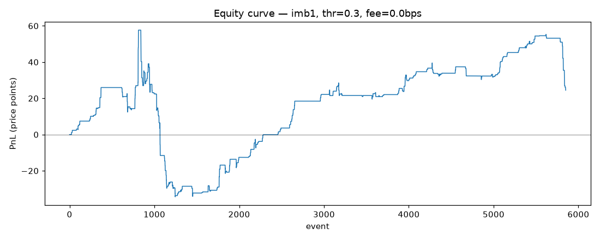
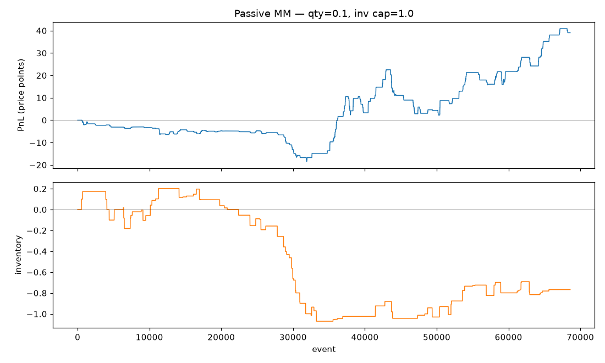

# Backtest — order-book-imbalance signal

The research layer. The C++ engine emits a per-event microstructure feature
stream (`lob_engine --emit`); `backtest.py` evaluates whether **order-book
imbalance** predicts the next mid-price move, and whether a naive strategy can
actually trade on it.

The two questions are kept separate on purpose, because they have very
different answers.

## 1. Is there signal?

Imbalance over the best *N* levels, `(bid_depth − ask_depth) / (bid_depth +
ask_depth)`, against the forward mid-price change (horizon in events). Measured
with **zero trading cost** — this is the pure predictive question.

On a real ~90-second BTC-USD capture (5,801 labelled events), imbalance is
clearly predictive, and the edge is **strongest at the touch and decays with
depth** — the classic microstructure result that the best bid/ask carries the
most information:

| Signal | Directional accuracy | Baseline | Edge | Corr with forward return |
|---|---|---|---|---|
| `imb1` (touch) | **0.736** | 0.599 | **+0.137** | 0.337 |
| `imb5` | 0.691 | 0.599 | +0.092 | 0.268 |
| `imb10` | 0.649 | 0.599 | +0.050 | 0.243 |

## 2. Can you trade it? (usually: no, naively)

A taker rule — go long when `imb > threshold`, short when `imb < −threshold`,
act **at the touch** (lift the offer / hit the bid, prices actually visible in
the book, no fill-model guesswork), mark to mid.

The predictive edge does **not** survive costs. Even with a ~1-cent spread on a
~$66k price, crossing on every signal erodes almost all of the gross edge, and
any realistic exchange fee turns it sharply negative:

| Taker fee (per leg) | Total PnL (bps of notional) |
|---|---|
| 0.0 bps | ≈ +0.3 |
| 0.5 bps | −190 |
| 1.0 bps | −381 |
| 5.0 bps | −1905 |



**That gap is the whole point.** A signal being predictive and a signal being
tradable are different claims, and the distance between them is the cost of
liquidity. It's exactly why real market-making strategies earn the spread by
quoting passively rather than paying it by crossing — which is the third study
below.

## 3. The other side: earn the spread (`market_maker.py`)

If crossing the spread loses, does *posting* it win? `market_maker.py` runs a
passive market maker on the unified quote+trade stream
(`lob_engine --emit-events`): it quotes a resting bid and ask at the touch and
is filled only when **real trades** reach it, using a queue-position fill model
(join the back of the level's queue; a trade eats the queue ahead before it
fills you). Inventory is capped, and P&L is marked to the mid and decomposed:

> **total P&L = spread captured + inventory P&L**

On a real 3-minute BTC-USD capture (1,717 trades, 390 fills):

| Component | Value |
|---|---|
| spread captured | +0.01 bps |
| inventory / adverse selection | +1.23 bps |
| **net (marked to mid)** | **+1.24 bps** |

The number to *not* be fooled by is the net. Almost none of it is spread — it's
inventory. The equity curve tracks the inventory line one-for-one:



**The honest reading:** on a penny-wide, hyper-liquid book like BTC-USD the
spread is only ~0.0015 bps, so there is almost nothing to capture passively, and
P&L is dominated by inventory risk — which over three minutes is just whichever
way the price happened to drift. This isn't a market-making edge; it's a
demonstration that **you can't evaluate one on this instrument at this time
scale.** A real evaluation needs (a) a much longer horizon so inventory noise
averages out, (b) a wider-spread instrument where spread capture is
economically meaningful, and (c) inventory-skewed quoting rather than naive
touch-joining. Those are the next steps.

Taken together, the taker (pays the spread → loses to fees) and the maker
(earns a spread too thin to matter → rides inventory noise) make the same
point from both directions: the directional edge the [ML model](../ml/README.md)
measures is real in *accuracy* terms but too small in *basis points* to
monetize naively on this market.

## Honest caveats

- **Overlapping windows.** Forward-return windows overlap across events, so the
  labelled samples are autocorrelated — the accuracy figures are descriptive,
  not a claim of statistical significance. A rigorous version uses
  non-overlapping windows or a block bootstrap.
- **One session, one product.** ~90 seconds of BTC-USD. Directions and
  magnitudes will move across regimes and instruments; this is a method, not a
  calibrated result.
- **No exchange latency / queue model.** Execution is at the touch on the same
  event the signal fires; a live taker would face send/ack latency.

## Run it

```bash
pip install -r requirements.txt

# Signal + taker backtest on the committed real-data sample:
python backtest.py ../data/features_sample.csv --signal imb1 --horizon 50 --threshold 0.30

# Passive market maker on the committed quote+trade sample:
python market_maker.py ../data/events_sample.csv --qty 0.1 --inv-cap 1.0 --plot mm_equity.png

# Full pipeline on a fresh capture (records trades too):
python ../data/capture_feed.py --product BTC-USD --seconds 180 --out ../data/feed.csv
../engine/build/lob_engine ../data/feed.csv --emit ../data/features.csv \
                                            --emit-events ../data/events.csv
python backtest.py ../data/features.csv --signal imb1 --plot equity.png
python market_maker.py ../data/events.csv --plot mm_equity.png
```

### Feature stream schema (`lob_engine --emit`)

One row per book **update** event, once the book is two-sided:
`event_idx, ts_ns, best_bid, best_ask, bid_size, ask_size, mid, microprice,
spread, imb1, imb5, imb10`. `microprice` is the size-weighted fair price
(computed and unit-tested in the C++ engine).
