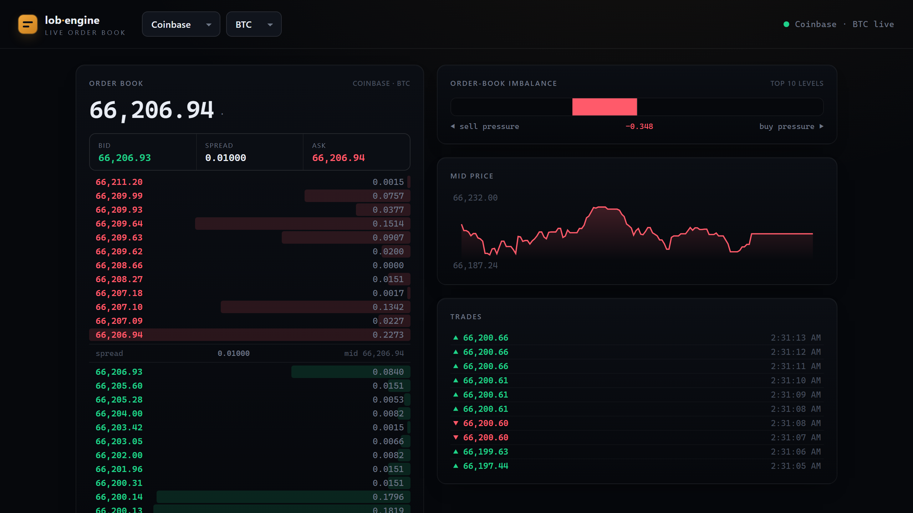
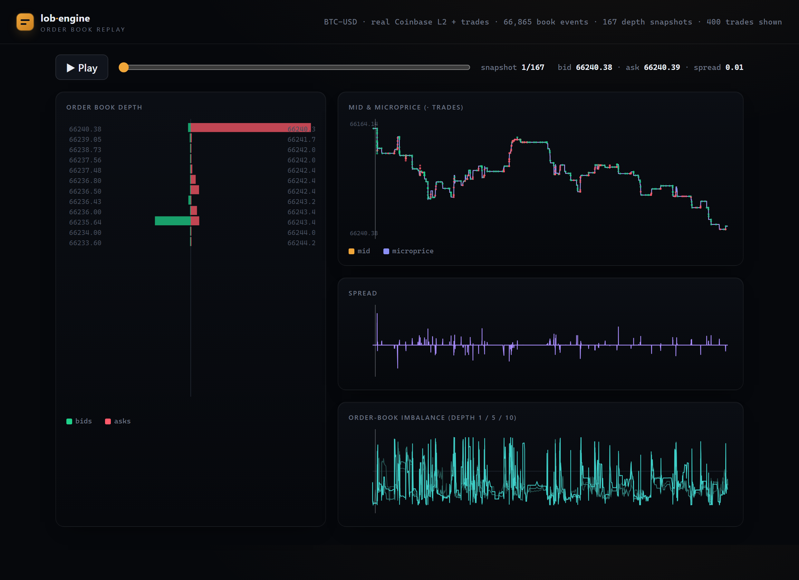

# Dashboard

Two self-contained HTML pages that share one design, no server and no external
libraries.

## `live.html` — live order book

Pick an exchange (Coinbase, Kraken, Binance.US) and a coin (BTC, ETH, SOL, XRP,
LTC, DOGE) and it connects straight from the browser to that exchange's public
market-data WebSocket, reconstructs the book in real time, and shows a depth
ladder, best bid/ask/spread with per-tick price flashes, order-flow imbalance, a
mid-price sparkline, and a trade tape. No API key; auto-connects to Coinbase BTC.
Because two venues are a click apart, you can watch the same coin on Coinbase and
Kraken and see their prices differ — the simplest cross-source sanity check.



## `dashboard.html` — replay

A **replay** of a captured session, built from the C++ engine's emitted streams:
an animated depth ladder, mid / microprice with trade prints, spread, and
order-book imbalance, with a cursor tying the time series to the depth snapshot
on screen. All data is inlined, so it opens straight from disk. The
reconstruction logic in `live.html` is the browser twin of the C++ engine — the
engine is the fast, unit-tested version that feeds the backtests and ML.



## How it's built

The C++ engine emits three streams from one replay:

- `--emit-depth` — periodic top-N depth ladders (the animated book),
- `--emit` — the per-event feature series (mid, microprice, spread, imbalance),
- `--emit-events` — quote+trade stream (the trade markers).

`build_dashboard.py` reads those, downsamples the time series, inlines
everything as JSON, and writes `dashboard.html`. It's deliberately a *rendering*
step in Python with a *pure-C++* data path — the engine does the reconstruction,
the dashboard just draws it.

## Run it

```bash
# 1) capture, then emit all three streams in one replay:
python ../data/capture_feed.py --product BTC-USD --seconds 180 --out ../data/feed.csv
../engine/build/lob_engine ../data/feed.csv \
    --emit ../data/feat.csv --emit-events ../data/ev.csv \
    --emit-depth ../data/depth.csv --depth-every 400 --depth-levels 12

# 2) build the page (open the result in any browser):
python build_dashboard.py --depth ../data/depth.csv \
    --features ../data/feat.csv --events ../data/ev.csv --out dashboard.html
```

`build_dashboard.py` is pure standard library. A committed `dashboard.html` is
included so the interactive view is viewable without capturing anything, and
`../data/depth_sample.csv` is a real depth sample for quick experiments.

The `live_dashboard.png` cover is a real screenshot of `live.html`, reproducible
from the committed samples: `python capture_cover.py` seeds `live.html` with a
captured snapshot (WebSocket disabled) into `_hero.html`, which any headless
Chromium can then screenshot (`msedge/chrome --headless=new --screenshot=...
_hero.html`).
