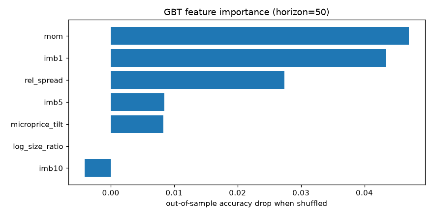

# ML — mid-price direction classifier

Does a trained model over the full order-book feature set predict the next
mid-price move better than the single-feature rule from the [backtest](../backtest/README.md)?
And — the part most student ML projects skip — does the edge survive
**out-of-sample**?

`train.py` trains a logistic regression and a gradient-boosted tree on the
features the C++ engine emits, and evaluates them walk-forward.

## What makes this an honest evaluation

- **Walk-forward, time-ordered splits.** Markets are a time series; a random
  train/test split leaks the future into the past and inflates every metric.
  Each fold trains on an earlier window and tests on a strictly later one.
- **Purge gap.** The label is a forward return over *H* events, so a sample's
  label peeks *H* events into the future. We drop *H* events at each
  train/test boundary so no training label overlaps the test window.
- **Two baselines the model must beat to justify itself:** the majority class,
  and the naive `sign(imb1)` rule. If a trained model can't beat one feature
  and a `sign()`, the extra machinery earns nothing.

## Result (real 4-minute BTC-USD capture, 6-fold walk-forward)

Out-of-sample accuracy, horizon = 50 events:

| Model | OOS accuracy | AUC |
|---|---|---|
| majority class | 0.537 | — |
| `sign(imb1)` baseline | 0.722 | — |
| **logistic regression** | **0.789** | **0.872** |
| gradient-boosted trees | 0.767 | 0.875 |

Two findings worth stating plainly:

1. **The trained model beats the single-feature baseline by ~7 points** out of
   sample — combining imbalance with momentum and the spread regime genuinely
   adds information over top-of-book imbalance alone.
2. **The linear model matches or beats the gradient-boosted tree.** The
   relationship is close to linear; the extra model capacity mostly overfits.
   More model is not more edge — a result worth trusting precisely because it's
   the unglamorous one.

**The edge is short-horizon and decays with time** — the same shape the
backtest found across book depth, now across the prediction horizon:

| Horizon | `sign(imb1)` | Logistic (OOS) | AUC |
|---|---|---|---|
| 20 events | 0.758 | **0.851** | 0.929 |
| 50 events | 0.722 | **0.789** | 0.872 |
| 100 events | 0.663 | 0.669 | 0.747 |

By 100 events the model's advantage over the naive baseline is gone — both are
decaying toward noise. That decay is the honest boundary of the signal.



Permutation importance (accuracy drop when a feature is shuffled) ranks recent
**momentum** and **top-of-book imbalance** first, with the spread regime third;
depth-10 imbalance adds nothing. Consistent with the backtest: the touch is
where the information is.

## Honest caveats

- **One session, one product.** ~4 minutes of BTC-USD. These magnitudes are a
  method demonstration, not a calibrated, deployable model.
- **Accuracy ≠ profit.** This predicts *direction*; the [backtest](../backtest/README.md)
  already showed a directional edge doesn't survive the cost of crossing the
  spread. A profitable use of this model is passive, not a taker — the next
  build.
- **Non-stationary class balance.** The up/down mix drifts across folds (note
  the high variance on the majority-class baseline), which is why walk-forward
  with several folds matters — a single split would mislead.

## Run it

```bash
pip install -r requirements.txt

# Runs on the committed real-data sample out of the box:
python train.py ../data/features_ml_sample.csv --horizon 50

# On a fresh, larger capture (better statistics):
python ../data/capture_feed.py --product BTC-USD --seconds 240 --out ../data/feed.csv
../engine/build/lob_engine ../data/feed.csv --emit ../data/features.csv
python train.py ../data/features.csv --horizon 50 --plot feature_importance.png
```

Features used: `imb1/5/10` (imbalance by depth), `microprice_tilt`
(microprice − mid), `rel_spread`, `mom` (backward momentum over the horizon),
`log_size_ratio` — all derived from the engine's emitted feature stream.
